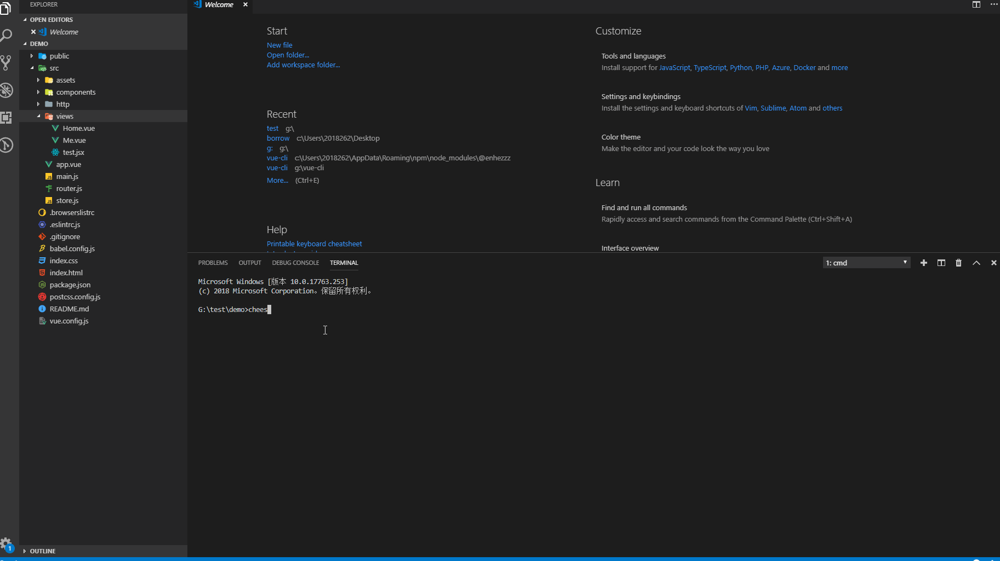

# vue-cli

only a simple vue-cli

> 全局安装

npm i -g @enhezzz/vue-cli

> 创建项目

cheese-vue create \<dirName\> [-y]

(如果输入-y选项将自动安装相关依赖)

https://github.com/fekun/vue-cli/blob/master/doc/newProject.gif

> 新建文件

cheese-vue new \<fileName\> [--jsx]

https://github.com/fekun/vue-cli/blob/master/doc/newFile.gif

